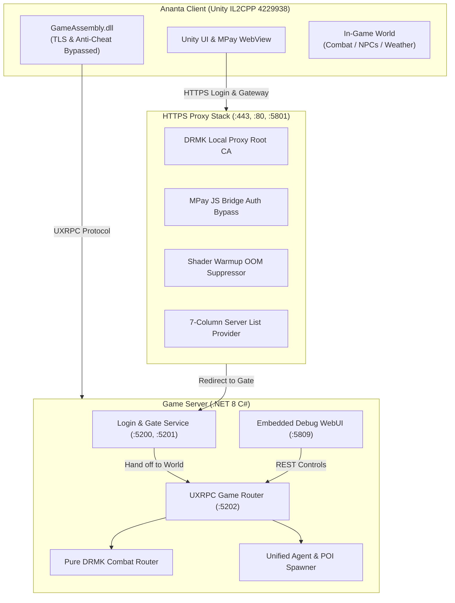

# Ananta & NetEase Unity Private Server Engine Skill

This skill provides the comprehensive architectural blueprint, protocol specifications, and operational runbooks for developing and maintaining private servers for **Project Mugen / Ananta (client 4229938)** and similar NetEase Unity/il2cpp titles.

---

## Architecture Overview



---

## Core System Pillars & Reference Manuals

### 1. Unified NPC & Monster Entity System
- **Single Agent Model**: Monsters, bosses, street citizens, police officers, and domestic animals all share the exact same entity schema defined in `AgentConfig.json` (9,347 records).
- **Faction Camps**: Camp `0`/`26` for hostile monsters/bosses, Camp `2` for civilians, Camp `11` for animals, Camp `16..25` for police/guards.
- **POI Actions**: Idle (`2`), Walk (`1`), Run (`4`), Phone Call (`11`), Lean on Wall (`10`), Sit (`12`/`13`), Clapping (`6`), and Panic (`3`).
- **Player-Relative Grid**: Spawns groups in front of the player based on live yaw angle and configurable X/Z spacing.
- 📖 [Detailed NPC & Monster System Guide](./references/npc_and_monster_system.md)

### 2. Pure DRMK Combat & Character Switching
- **Unbroken Combos**: Eliminates artificial server-side cooldown ticks (`SkillCooldownUntilTicks`) so multi-hit light attacks, heavy attacks, and skills chain smoothly without animation stutter.
- **Authoritative Replenish**: Stamina and ultimate charge are replenished exclusively when the full combo chain finishes (`restoreResources == true`).
- **Clean Despawn (`SyncLogicAgentLeave`)**: Formally removes previous characters from the world when switching, completely preventing character lockups, ghost entities, and floating "F" interaction prompts.
- 📖 [Detailed Combat & Switching Architecture Guide](./references/combat_and_switching_system.md)

### 3. Scene ("Raid") Switching, Weather & Map Warp
- **Triad ID Architecture**: Scene transitions require authoritative `raidId`, `instanceId`, and `universeId` matching `RaidConfig.json` and `MapentranceConfig.json`.
- **Hybrid Atmospheric Control**: 5 standard weather states (`WeatherCatalog4229938`) coupled with client overrides for GPU particle rain (`SetGPURainActive`) and Volumetric Exponential Fog (`SetFogDensity`).
- **2-Click Pin & Warp**: Click once to place pin, click pin again to warp. Protects against fallback to void coordinates `(0, 0, 0)`.
- 📖 [Detailed Scene, Weather & Map Warp Guide](./references/scene_and_weather_system.md)

### 4. Embedded Debug API & Web Management Panel
- **Integrated Daemon**: Self-contained HTTP REST server on `http://127.0.0.1:5809/` with frontend `index.html` compiled into `Ananta.App.dll`.
- **Interactive Catalog Table**: Realtime search across all 9,347 agents with category tabs, pose picker, and `[➕ Add]` buttons to queue spawn commands instantly.
- 📖 [Detailed Debug API & WebUI Guide](./references/debug_api_and_webui.md)

### 5. Multi-Domain HTTPS Proxy & Auth Bypass
- **Native MPay JS Bridge**: Auto-authenticates web logins without touching NetEase authentication servers.
- **Shader Warmup OOM Prevention**: Suppresses the 11k shader pre-warmup routine (`triggerWarmupBelowVersion: ""`) to prevent 19GB memory exhaustion.
- **7-Column Server List**: Passes client Contract MD5 verification.
- 📖 [Detailed Proxy & Security Bypass Guide](./references/proxy_and_security_bypass.md)

### 6. Protocol Codec & V7 4-Step World Entry
- Strict handoff sequence: `SyncLogicAgentEnter` $\to$ `SyncManagedLogicAgent` $\to$ `SyncRaidBattleUnitSpirit` $\to$ `SyncPlayerCurrentSpirit` $\to$ `SyncSceneLoadCompleted`.
- 📖 [Detailed Protocol & World Entry Guide](./references/protocol_and_world_entry.md)

### 7. Client Binary Patching (`GameAssembly.dll`)
- TLS certificate pinning bypass (`ValidateCertificate` $\to$ `31 C0 C3`).
- NEAC anti-cheat driver suppression.
- 📖 [Detailed Binary Patching Guide](./references/binary_patching_guide.md)

---

## Standard Runbook

### Step 1: Network & Certificate Preparation
1. Verify `C:\Windows\System32\drivers\etc\hosts` redirects `l50.update.netease.com` and related domains to `127.0.0.1`.
2. Ensure `DRMK Local Proxy Root` CA is installed in `Cert:\LocalMachine\Root`.
3. Verify ports `80`, `443`, `5801`, `5200`, `5201`, `5202`, and `5809` are free.

### Step 2: Game Directory Verification
- `NtUniSdkBase.dll`: Must be original NetEase DLL (~6.16 MB), never a dummy stub.
- `GameAssembly.dll`: Patched with TLS pinning bypass (`31 C0 C3`).
- `boot.config`: Original game version (`pkg-version=20260804051818394p0`).

### Step 3: Launching Stack
Run proxy and server together:
```powershell
# From workspace root:
.\START.cmd
```

### Step 4: Verification Checklist
- [ ] Proxy logs `[PX] listening on https://0.0.0.0:443`.
- [ ] Server prints `[READY] Приватный Сервер | client=4229938 | login=:5200,:5201 | game=:5202`.
- [ ] Launch `Ananta.exe`.
- [ ] No "Configuration content is corrupted" dialog.
- [ ] No 19GB RAM OOM crash.
- [ ] WebUI accessible at `http://127.0.0.1:5809/`.
- [ ] Entering world completes with active character controllable.
